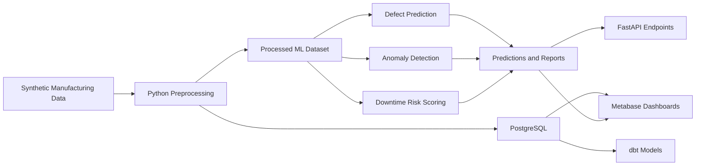

# Manufacturing Quality & Equipment Anomaly Intelligence Platform

A production-oriented manufacturing analytics prototype that uses synthetic manufacturing data to demonstrate quality prediction, equipment anomaly detection, downtime risk scoring, analytics engineering, dashboarding, and API delivery in one local end-to-end workflow.

## Project Overview
This repository simulates a manufacturing environment where machine telemetry, production batches, quality checks, downtime events, and maintenance logs are connected through a reproducible Python, PostgreSQL, dbt, Metabase, and FastAPI pipeline. It is intentionally positioned as a prototype for portfolio and interview discussion, not as a real plant deployment.

## Business Problem
Manufacturing teams need better ways to:
- detect early quality drift
- identify abnormal equipment behavior
- prioritize maintenance review
- understand operational efficiency across lines and shifts

This project shows how AI/ML, analytics engineering, and dashboarding can support human-in-the-loop operational decision making.

## Verified End-to-End Locally
The following workflow has been verified locally:
- Local Python demo pipeline passed
- Smoke test passed
- `pytest` passed
- Docker PostgreSQL container started successfully
- `python -m src.load_to_postgres` loaded data into PostgreSQL successfully
- `dbt debug --profiles-dir .` passed
- `dbt run --profiles-dir . --no-partial-parse` passed with `PASS=14 WARN=0 ERROR=0`
- `dbt test --profiles-dir .` passed with `PASS=31 WARN=0 ERROR=0`
- dbt analytics marts created in schema `analytics`:
  - `mart_machine_health`
  - `mart_quality_risk`
  - `mart_oee_dashboard`
  - `mart_maintenance_priority`
- Metabase is running locally at [http://127.0.0.1:3000](http://127.0.0.1:3000)
- Metabase connected successfully to PostgreSQL using host `postgres`, port `5432`, database `manufacturing`
- Metabase dashboard was created successfully
- FastAPI docs screenshot and Metabase dashboard screenshots were captured successfully

## GM Role Alignment
- `AI/ML experimentation`: compares Logistic Regression, RandomForest, and optional XGBoost-style workflows using ROC-AUC, precision, recall, F1, confusion matrix, and feature importance outputs
- `Analytics engineering`: uses PostgreSQL and dbt to transform raw manufacturing records into staging, intermediate, and mart models
- `Manufacturing analytics`: focuses on quality prediction, equipment anomaly detection, downtime risk scoring, and OEE-style operational KPIs
- `Automation and reproducibility`: includes Makefile targets, PowerShell scripts, smoke tests, pytest coverage, and screenshot automation
- `Business communication`: provides dashboard queries, architecture notes, project status documentation, and recruiter-friendly visual artifacts

## Architecture Diagram


## Tech Stack
- Python
- Pandas and NumPy
- scikit-learn
- XGBoost when installed, otherwise graceful fallback
- PostgreSQL
- dbt
- Metabase
- FastAPI
- matplotlib
- Playwright for automated screenshot capture

## Repository Structure
```text
manufacturing-quality-anomaly-platform/
|-- api/
|-- assets/
|-- data/
|-- dbt_mfg/
|-- metabase/
|-- models/
|-- reports/
|-- scripts/
|-- src/
|-- tests/
|-- .github/workflows/
|-- docker-compose.yml
|-- Dockerfile
|-- Makefile
|-- PROJECT_STATUS.md
|-- README.md
`-- RESUME_BULLETS.md
```

## Data Model Explanation
The synthetic data simulates:
- machines with machine type, age, baseline health score, and line assignment
- sensor readings with temperature, vibration, pressure, cycle time, and energy consumption
- production batches with product type, material batch, operator team, and throughput
- quality checks with defect probability, defect type, and defect count
- downtime events linked to abnormal operating conditions
- maintenance logs used for maintenance recency and operational context

### Synthetic Data Limitations
All data in this project is synthetic. It is designed to create realistic relationships for experimentation, preprocessing, feature engineering, model validation, dashboard prototyping, and API demonstration. It should not be described as real plant data, plant-validated performance, or deployed manufacturing decision automation.

## Sample Outputs
To make the repository easier to browse on GitHub, the project includes small representative sample files in `data/sample/`.

Included sample files:
- `data/sample/sample_machines.csv`
- `data/sample/sample_sensor_readings.csv`
- `data/sample/sample_defect_predictions.csv`
- `data/sample/sample_anomaly_scores.csv`
- `data/sample/sample_downtime_risk_scores.csv`
- `data/sample/sample_maintenance_priority.csv` when maintenance priority output is available
- `data/sample/sample_oee_summary.csv` when an OEE summary output is available

These files contain only 10 to 30 rows each and are intended for quick review, documentation, and recruiter-friendly browsing. Larger generated files in `data/raw`, `data/processed`, and `data/predictions` can be regenerated locally.

## Project Screenshots
The screenshots below are verified local artifacts. `api_docs.png` is a real FastAPI docs capture. The Metabase screenshots are real local Metabase dashboard captures.


## Pipeline Workflow
1. Generate synthetic raw manufacturing data.
2. Build processed ML features in `data/processed/ml_training_dataset.csv`.
3. Load raw and processed data into PostgreSQL.
4. Build dbt staging, intermediate, and mart models.
5. Train quality prediction models.
6. Detect equipment anomalies.
7. Score downtime risk and maintenance priority.
8. Expose outputs through Metabase-ready SQL and FastAPI endpoints.

## ML Methodology
- Defect prediction models:
  - Logistic Regression baseline
  - RandomForest
  - optional XGBoost if installed
- Model selection:
  - compares ROC-AUC, precision, recall, F1, and a composite score
- Outputs:
  - `reports/model_evaluation.md`
  - `reports/metrics.json`
  - `reports/classification_report.json`
  - `reports/confusion_matrix.csv`
  - `data/predictions/feature_importance.csv`
  - `data/predictions/defect_predictions.csv`

## Anomaly Detection Method
Equipment anomaly detection combines:
- Isolation Forest for unsupervised outlier detection
- rule-based z-score checks for temperature, vibration, pressure, cycle time, and energy consumption

The output includes anomaly score, anomaly flag, anomaly reason, machine ID, and timestamp-level records.

## Downtime Risk Scoring Method
Downtime risk scoring creates a 0-100 machine risk score using:
- anomaly count signals
- vibration risk
- temperature risk
- cycle time drift risk
- previous downtime indicators
- maintenance recency factors

Risk bands:
- Low
- Medium
- High
- Critical

These outputs are intended for decision support and maintenance prioritization, not autonomous maintenance actions.

## API Endpoints
- `GET /health`
- `GET /kpis/overview`
- `GET /machines/health`
- `GET /machines/high-risk`
- `GET /quality/defect-trends`
- `GET /anomalies/recent`
- `GET /maintenance/priority`
- `POST /predict/defect-risk`

## Metabase Dashboard Setup
Verified local setup flow:
1. Start PostgreSQL:
   ```bash
   docker compose up -d postgres
   ```
2. Load data into PostgreSQL:
   ```bash
   python -m src.load_to_postgres
   ```
3. Run dbt from `dbt_mfg`:
   ```bash
   cd dbt_mfg
   dbt debug --profiles-dir .
   dbt run --profiles-dir . --no-partial-parse
   dbt test --profiles-dir .
   cd ..
   ```
4. Start Metabase:
   ```bash
   docker compose up -d metabase
   ```
5. Open [http://127.0.0.1:3000](http://127.0.0.1:3000)
6. Connect PostgreSQL in Metabase using:
   - host: `postgres`
   - port: `5432`
   - database: `manufacturing`
7. Use `metabase/dashboard_queries.sql` to create cards and assemble the dashboard.

See also:
- `metabase/dashboard_queries.sql`
- `metabase/dashboard_setup.md`

## Windows PowerShell Quickstart
From the project root:

### Local Demo Pipeline
```powershell
python -m pip install -r requirements.txt
.\scripts\run_demo.ps1
```

### PostgreSQL + dbt + Metabase Workflow
```powershell
docker compose up -d postgres
python -m src.load_to_postgres
Push-Location .\dbt_mfg
dbt debug --profiles-dir .
dbt run --profiles-dir . --no-partial-parse
dbt test --profiles-dir .
Pop-Location
docker compose up -d metabase
```

### Run FastAPI Locally
```powershell
.\scripts\run_api.ps1
```

### Capture Screenshots
```powershell
python -m playwright install chromium
.\scripts\capture_screenshots.ps1
```

### Verify Outputs and Tests
```powershell
.\scripts\verify_outputs.ps1
python -m src.smoke_test
python -m pytest tests -q
```

## Makefile Commands
- `make setup`
- `make up`
- `make down`
- `make generate-data`
- `make load-db`
- `make dbt-run`
- `make train`
- `make anomalies`
- `make risk`
- `make api`
- `make test`
- `make all`

## Supported Resume Claims
The following claims are supported by the current verified local state:
- Built a production-oriented manufacturing analytics prototype using Python, PostgreSQL, dbt, FastAPI, and Metabase.
- Developed end-to-end pipelines for synthetic manufacturing data generation, preprocessing, model training, anomaly detection, downtime risk scoring, and maintenance prioritization.
- Created analytics-ready dbt marts for machine health, quality risk, OEE-style reporting, and maintenance priority.
- Validated the local workflow with smoke tests, `pytest`, PostgreSQL loading, dbt run/test success, and dashboard/API screenshots.
- Produced dashboard and API artifacts for human-in-the-loop operational decision support on synthetic manufacturing data.

Claims to avoid:
- Do not say the project used real plant or GM production data.
- Do not say the project was deployed in a live factory.
- Do not claim real downtime reduction or business impact.
- Do not describe the risk scoring as production-calibrated on real plant outcomes.

## Project Limitations
- Synthetic manufacturing data only
- Production-oriented prototype, not a real plant deployment
- Risk scoring is decision support logic and would require calibration on real operational data
- API currently serves local artifacts and prototype analytics views rather than a hardened production backend

## Future Improvements
- Add calibration analysis and drift monitoring
- Add richer experiment tracking and artifact lineage
- Add plant-specific business rules for downtime thresholds
- Add database-backed API queries and pagination
- Add richer dashboard drill-downs by line, shift, and product type
