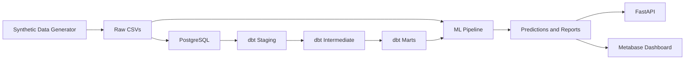
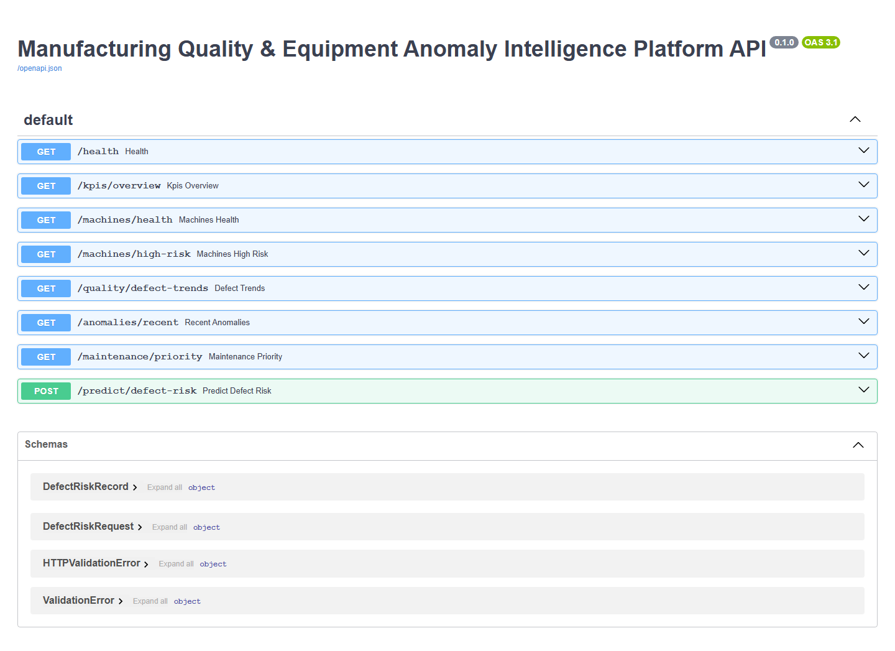
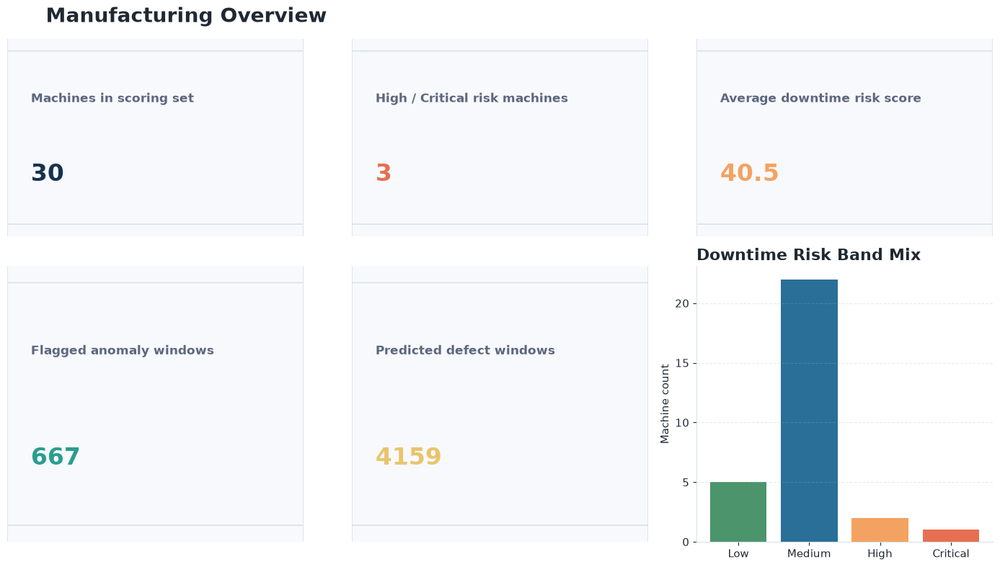
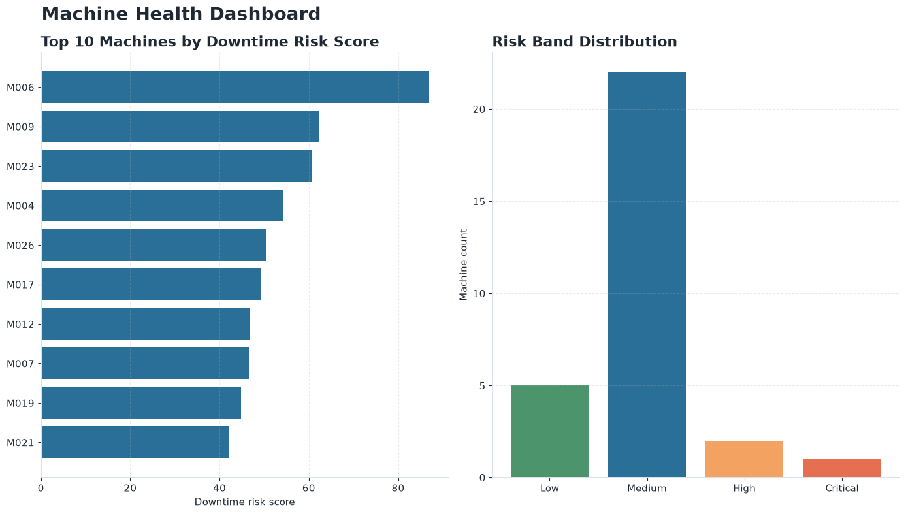
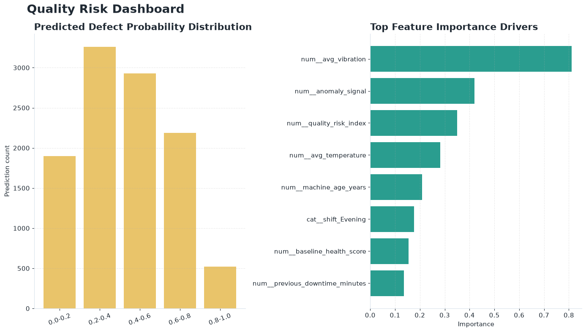
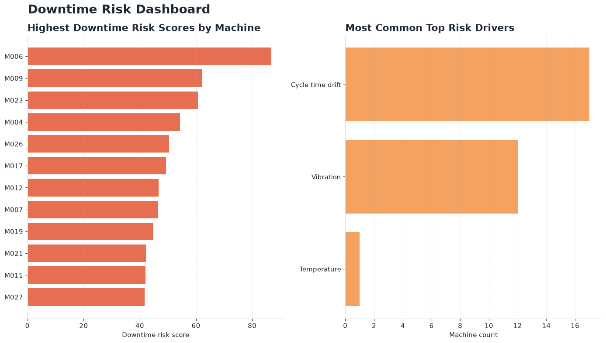
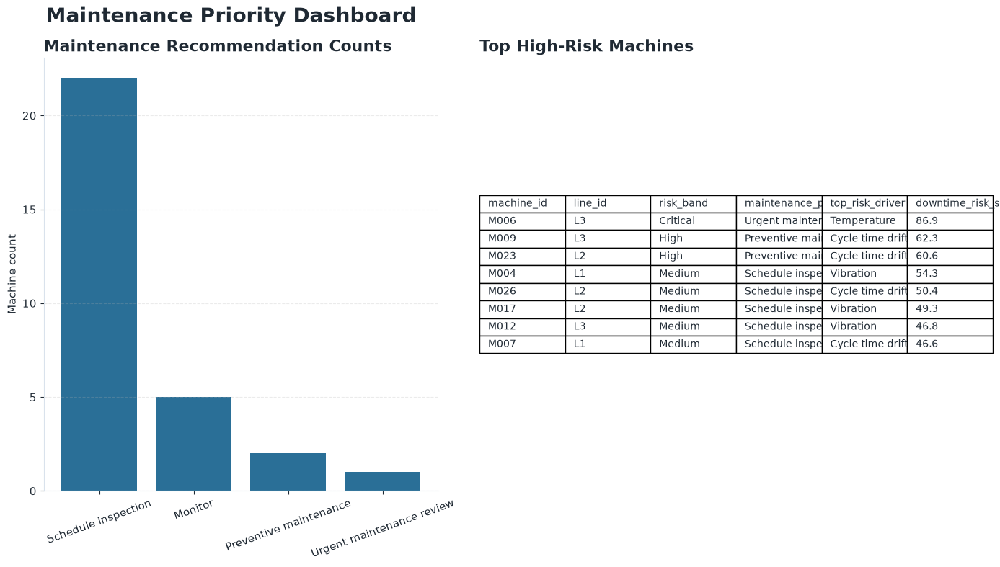
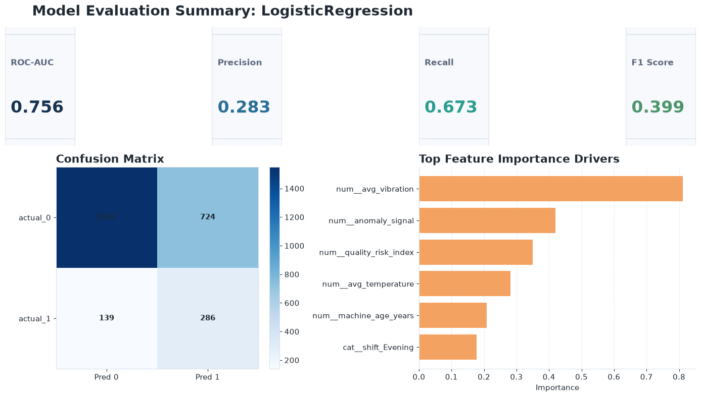
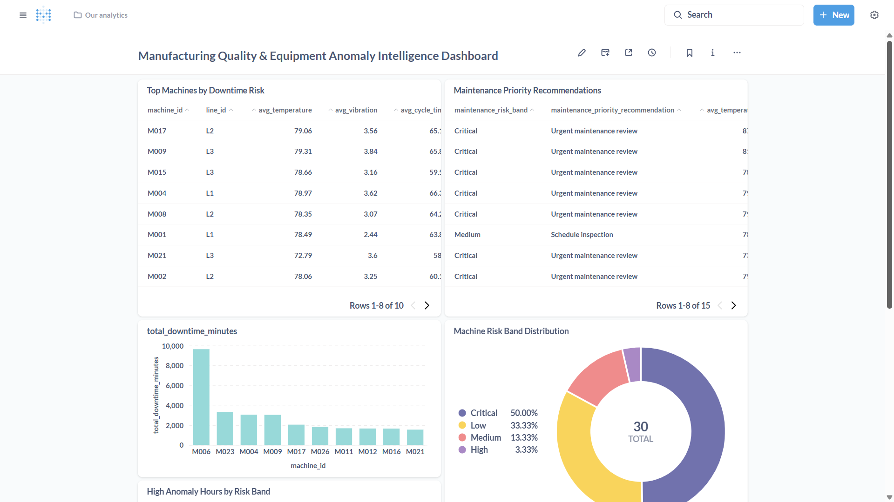
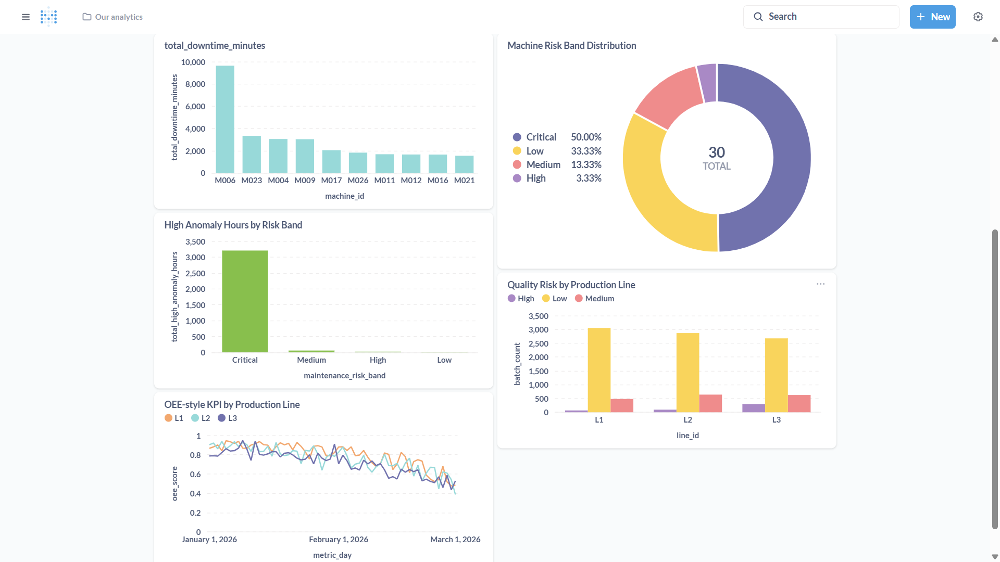

# Manufacturing Quality & Equipment Anomaly Intelligence Platform

Production-oriented manufacturing analytics prototype for quality prediction, equipment anomaly detection, downtime risk scoring, and OEE-style operational decision support.


[](https://github.com/tusharg007/Equipment-Anomaly-Intelligence/actions/workflows/ci.yml)

## Executive Summary
Manufacturing and operations teams care about defects, downtime, equipment instability, and line efficiency because those issues directly affect throughput, rework, maintenance load, and operator decision-making. A useful analytics workflow needs to connect raw telemetry, quality outcomes, downtime history, and maintenance context instead of treating each signal in isolation.

This repository demonstrates that workflow as a production-oriented prototype built on synthetic manufacturing data. It moves from raw CSV generation to PostgreSQL loading, dbt transformation layers, machine learning outputs, FastAPI endpoints, and dashboard-ready assets, while keeping the documentation honest about model limitations and synthetic-data constraints.

The result is a recruiter-friendly and technically reviewable project that shows how manufacturing analytics, AI/ML, dashboarding, testing, and engineering discipline can fit together in a realistic local prototype.

## Key Features
- Synthetic manufacturing data generation with correlated operational signals across quality, downtime, and maintenance events
- PostgreSQL warehouse for raw and analytics-ready manufacturing data
- dbt staging, intermediate, and mart layers for plant-style analytics modeling
- Defect prediction pipeline with model evaluation artifacts
- Equipment anomaly detection using Isolation Forest and rule-based checks
- Downtime risk scoring for decision-support prioritization
- Maintenance priority recommendations for high-risk machines
- OEE-style operational KPIs for line-level performance review
- FastAPI serving layer for KPIs, machine health, anomalies, maintenance, and defect-risk inference
- Metabase dashboard workflow with screenshots and dashboard query templates
- Responsible AI and model documentation including a model card and limitations notes
- pytest coverage, smoke tests, PowerShell helpers, Docker Compose setup, and GitHub Actions CI

## Recruiter / Interviewer Quick Scan
| What this project demonstrates | Evidence in repo |
|---|---|
| Manufacturing analytics and plant-style data modeling | `src/generate_synthetic_data.py`, `dbt_mfg/models/`, `data/sample/` |
| AI/ML model development | `src/train_defect_model.py`, `reports/model_evaluation.md`, `reports/metrics.json` |
| Anomaly detection | `src/detect_anomalies.py`, `data/predictions/anomaly_scores.csv` |
| Operations efficiency and downtime prioritization | `src/downtime_risk_scoring.py`, `data/predictions/downtime_risk_scores.csv`, `data/predictions/maintenance_priority.csv` |
| Dashboarding and BI | `metabase/dashboard_queries.sql`, `assets/metabase_dashboard_top.png`, `assets/metabase_dashboard_bottom.png` |
| Engineering discipline | `tests/`, `.github/workflows/ci.yml`, `docker-compose.yml`, `Makefile`, `scripts/` |
| Communication and governance | `reports/model_card.md`, `reports/responsible_ai_notes.md`, `PROJECT_STATUS.md` |

## Architecture


## Tech Stack
### Programming / Data
- Python
- Pandas
- NumPy

### Machine Learning
- scikit-learn
- Logistic Regression
- RandomForest
- optional XGBoost workflow support when installed
- Isolation Forest

### Data Warehouse / Analytics Engineering
- PostgreSQL
- dbt

### BI / Dashboarding
- Metabase
- matplotlib for generated dashboard-style visuals

### API / Serving
- FastAPI
- Uvicorn

### Quality / DevOps
- pytest
- GitHub Actions CI
- Docker Compose
- PowerShell helper scripts

## Dataset Design
Synthetic data is used so the project can demonstrate realistic manufacturing analytics patterns without exposing proprietary plant data or pretending to represent a live production system. The generator creates data relationships that are useful for experimentation, preprocessing, model evaluation, dashboarding, and interview discussion.

Simulated entities include:
- machines
- production lines
- sensor readings
- production batches
- quality checks
- downtime events
- maintenance logs

Modeled relationships include:
- higher temperature and vibration increasing defect and downtime risk
- older machines showing more anomalous behavior
- maintenance events reducing near-term risk signals
- pressure instability and cycle-time drift affecting quality outcomes
- shift-level variation across operational patterns

| CSV file | Purpose |
|---|---|
| `data/raw/machines.csv` | Machine master data including line assignment, machine type, age, and baseline health |
| `data/raw/production_batches.csv` | Batch-level production context including line, shift, product type, and operator context |
| `data/raw/sensor_readings.csv` | Telemetry signals such as temperature, vibration, pressure, cycle time, and energy consumption |
| `data/raw/quality_checks.csv` | Quality inspection outcomes, defect probability context, and defect labels |
| `data/raw/downtime_events.csv` | Downtime events linked to machine conditions and event duration |
| `data/raw/maintenance_logs.csv` | Maintenance interventions and post-maintenance status context |
| `data/processed/ml_training_dataset.csv` | Feature-engineered modeling dataset used for defect prediction |

## Pipeline Workflow
1. Generate synthetic plant-style data.
2. Run data quality checks.
3. Load raw and processed data into PostgreSQL.
4. Transform data with dbt staging, intermediate, and mart layers.
5. Train the defect prediction model.
6. Detect equipment anomalies.
7. Score downtime risk and maintenance priority.
8. Serve outputs through FastAPI.
9. Build the dashboard in Metabase.
10. Document metrics, assumptions, and limitations in reports.

## Machine Learning Methodology
### Defect Prediction
The primary supervised task is defect prediction using the synthetic manufacturing training dataset. The target variable is `defect_flag`, and the feature set includes operational signals such as temperature, vibration, pressure, cycle time, maintenance recency, anomaly-related indicators, line/shift context, and derived quality-risk features.

The workflow compares a baseline Logistic Regression model with a tree-based RandomForest model, with optional XGBoost support when installed. Evaluation artifacts include:
- ROC-AUC
- precision
- recall
- F1 score
- confusion matrix
- feature importance

### Anomaly Detection
Equipment anomaly detection combines:
- Isolation Forest for unsupervised outlier detection
- rule-based z-score checks for sensor drift and instability

This produces anomaly scores, flags, and explainable anomaly reasons that can be used downstream for maintenance and downtime review.

### Downtime Risk Scoring
Downtime risk is modeled as a heuristic decision-support score that combines anomaly behavior, downtime history, sensor drift, and maintenance recency into a 0-100 machine risk score with categorical risk bands.

All metrics and predictions in this repository are generated from synthetic manufacturing data and should be interpreted as prototype validation, not real-world plant performance claims.

## OEE-style Operational KPIs
The analytics and dashboard workflow includes OEE-style operational indicators to make the prototype more relevant for manufacturing and operations review.

- Availability: estimated operating time relative to downtime impact
- Performance: cycle-time and throughput-style efficiency indicators
- Quality: quality outcomes and defect behavior across lines and machines
- OEE: a combined operational view used as a practical indicator rather than a claim of plant-calibrated production OEE

These KPIs are used as operational indicators in the dbt marts and dashboard views to help connect ML outputs with manufacturing performance context.

## Screenshots
### FastAPI Documentation


### Manufacturing Overview


### Machine Health Dashboard


### Quality Risk Dashboard


### Downtime Risk Dashboard


### Maintenance Priority Dashboard


### Model Evaluation Summary


### Metabase Dashboard



## Verified End-to-End Locally
- Local Python demo pipeline passed
- Smoke test passed
- `pytest` passed locally
- Docker PostgreSQL container started successfully
- Data loaded into PostgreSQL successfully
- `dbt debug --profiles-dir .` passed
- `dbt run --profiles-dir . --no-partial-parse` verified with `PASS=14 WARN=0 ERROR=0`
- `dbt test --profiles-dir .` verified with `PASS=31 WARN=0 ERROR=0`
- Analytics schema created dbt marts:
  - `mart_machine_health`
  - `mart_quality_risk`
  - `mart_oee_dashboard`
  - `mart_maintenance_priority`
- Metabase dashboard connected and created successfully
- FastAPI docs verified locally

## Quickstart - Local Python Pipeline
### Windows PowerShell
```powershell
python -m venv .venv
.\.venv\Scripts\Activate.ps1
pip install -r requirements.txt
.\scripts\run_demo.ps1
```

### Manual Fallback
```powershell
python -m src.generate_synthetic_data
python -m src.data_quality_checks
python -m src.train_defect_model
python -m src.detect_anomalies
python -m src.downtime_risk_scoring
python -m src.smoke_test
pytest tests -q
```

## Full Stack Setup - PostgreSQL, dbt, Metabase
```powershell
copy .env.example .env
docker compose up -d postgres
$env:PYTHONPATH = "$PWD\src;$PWD"
python -m src.load_to_postgres
cd dbt_mfg
dbt debug --profiles-dir .
dbt run --profiles-dir . --no-partial-parse
dbt test --profiles-dir .
cd ..
docker compose up -d metabase
```

Then:
- open [http://127.0.0.1:3000](http://127.0.0.1:3000)
- connect PostgreSQL using host `postgres`, port `5432`, database `manufacturing`
- use `metabase/dashboard_queries.sql` to create dashboard cards

## FastAPI Usage
```powershell
$env:PYTHONPATH = "$PWD\src;$PWD"
uvicorn api.main:app --reload --host 0.0.0.0 --port 8000
```

Then open [http://127.0.0.1:8000/docs](http://127.0.0.1:8000/docs).

Available endpoints:
- `/health`
- `/kpis/overview`
- `/machines/health`
- `/machines/high-risk`
- `/quality/defect-trends`
- `/anomalies/recent`
- `/maintenance/priority`
- `/predict/defect-risk`

## Repository Structure
```text
data/
src/
api/
dbt_mfg/
metabase/
reports/
assets/
tests/
.github/workflows/
docker-compose.yml
README.md
```

## Important Reports
- `reports/model_evaluation.md`
- `reports/model_card.md`
- `reports/responsible_ai_notes.md`
- `reports/business_impact_summary.md`
- `reports/architecture.md`
- `PROJECT_STATUS.md`
- `RESUME_BULLETS.md`

## Supported Resume Claims
- Built a production-oriented manufacturing analytics platform prototype using Python, PostgreSQL, dbt, FastAPI, and Metabase.
- Developed ML pipelines for quality defect prediction and equipment anomaly detection using feature engineering, validation metrics, and explainability artifacts.
- Designed downtime risk scoring and maintenance priority logic to support human-in-the-loop operational decision-making.
- Built dashboard-ready analytics marts for machine health, quality risk, OEE-style KPIs, and maintenance prioritization.
- Documented limitations, model assumptions, and responsible AI considerations for synthetic-data decision support.

## Limitations
- Uses synthetic manufacturing data
- Not connected to real machines, SCADA systems, MES platforms, or plant systems
- Not deployed in production
- Risk scoring needs calibration on real plant data before operational use
- Predictions are decision support outputs, not automated maintenance instructions

## Future Improvements
- Integrate real sensor, SCADA, or MES data sources
- Add streaming ingestion for near-real-time monitoring
- Add model monitoring and drift detection
- Add richer root-cause analysis workflows
- Add role-based dashboard access
- Add cloud deployment options
- Integrate with alerting or work-order systems
