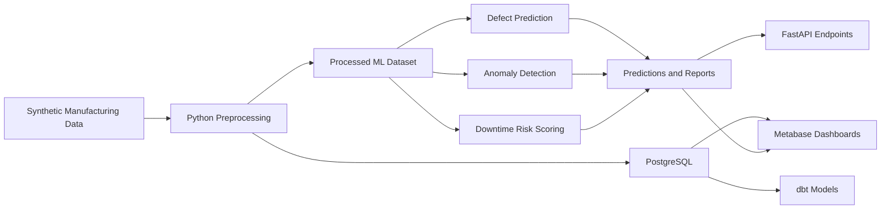

# Manufacturing Quality & Equipment Anomaly Intelligence Platform

A production-oriented prototype for manufacturing analytics, quality prediction, equipment anomaly detection, downtime risk scoring, and OEE-style operational KPIs. The repository uses synthetic manufacturing data and honest documentation to demonstrate a professional end-to-end AI/ML and analytics workflow suitable for a General Motors AI/ML Intern portfolio conversation.

## Project Overview
This project simulates a manufacturing environment where machine telemetry, production batches, quality checks, downtime events, and maintenance logs are connected through one analytics pipeline. It is intentionally positioned as a production-oriented prototype rather than a real plant deployment.

## Business Problem
Manufacturing operations teams need better ways to:
- detect early quality drift
- identify abnormal machine behavior
- prioritize maintenance attention
- understand operational efficiency across lines

This project demonstrates how data engineering, ML, and dashboarding can work together to support human-in-the-loop decision support for those problems.

## Why This Matters
Manufacturing quality issues and equipment instability can raise scrap, rework, downtime, and throughput loss. A workflow that connects sensor patterns, quality outcomes, maintenance activity, and OEE-style operational KPIs helps engineering teams review risk earlier and act more consistently.

## GM Role Alignment
- `AI/ML experimentation`: compares Logistic Regression, RandomForest, and optional XGBoost using ROC-AUC, precision, recall, F1, confusion matrix, and classification report outputs
- `Analytics engineering`: uses PostgreSQL and dbt to transform raw manufacturing records into staging, intermediate, and mart models
- `Manufacturing analytics`: focuses on quality prediction, equipment anomaly detection, downtime risk scoring, and OEE-style operational KPIs
- `Automation and reproducibility`: includes Makefile targets, smoke tests, pytest coverage, and GitHub Actions CI
- `Business communication`: provides Metabase-ready SQL, architecture notes, responsible AI notes, and project status documentation

## Architecture Diagram


## Tech Stack
- Python
- Pandas and NumPy
- scikit-learn
- XGBoost when installed, otherwise graceful fallback
- PostgreSQL
- dbt
- Metabase
- FastAPI

## Repository Structure
```text
manufacturing-quality-anomaly-platform/
|-- api/
|-- data/
|-- dbt_mfg/
|-- metabase/
|-- models/
|-- reports/
|-- src/
|-- tests/
|-- .github/workflows/
|-- docker-compose.yml
|-- Dockerfile
|-- Makefile
|-- PROJECT_STATUS.md
|-- README.md
`-- RESUME_BULLETS.md
```

## Data Model Explanation
The synthetic data simulates:
- machines with machine type, age, baseline health, and line assignment
- hourly sensor readings with temperature, vibration, pressure, cycle time, and energy consumption
- production batches with product type, material batch, operator team, and throughput
- quality checks with defect probability, defect type, and defect count
- downtime events linked to abnormal operating conditions
- maintenance logs that reduce near-term risk after intervention

### Synthetic Data Limitations
All data is synthetic. It is designed to create realistic and defensible relationships for experimentation, feature engineering, model validation, and dashboard prototyping. It should not be described as plant-validated or operationally deployed.

## Pipeline Workflow
1. Generate synthetic raw manufacturing data
2. Build processed ML features in `data/processed/ml_training_dataset.csv`
3. Optionally load raw and processed data into PostgreSQL
4. Build dbt staging, intermediate, and mart models
5. Train quality prediction models
6. Detect equipment anomalies
7. Score downtime risk and maintenance priority
8. Expose outputs through Metabase-ready SQL and FastAPI endpoints

## ML Methodology
- Defect prediction models:
  - Logistic Regression baseline
  - RandomForest
  - XGBoost if installed
- Model selection:
  - based on ROC-AUC and F1 balance
- Outputs:
  - metrics JSON
  - `reports/model_evaluation.md`
  - confusion matrix CSV
  - classification report JSON
  - feature importance
  - defect predictions

## Model Metrics
The latest generated metrics are stored in:
- `reports/model_evaluation.md`
- `reports/metrics.json`
- `reports/classification_report.json`
- `reports/confusion_matrix.csv`

These metrics are generated from the current synthetic dataset and should be interpreted as prototype validation, not real manufacturing accuracy claims.

## Anomaly Detection Method
Equipment anomaly detection combines:
- Isolation Forest for unsupervised outlier scoring
- rule-based z-score checks for temperature, vibration, pressure, cycle time, and energy consumption

The output includes:
- anomaly score
- anomaly flag
- anomaly reason
- machine_id
- timestamp

## Downtime Risk Scoring Method
Downtime risk scoring creates a 0-100 machine risk score using:
- anomaly_count_24h
- vibration risk
- temperature risk
- cycle time drift risk
- previous downtime risk
- maintenance recency factor

Risk bands:
- Low
- Medium
- High
- Critical

Outputs are used for human-in-the-loop decision support through maintenance priority recommendations.

## API Endpoints
- `GET /health`
- `GET /kpis/overview`
- `GET /machines/health`
- `GET /machines/high-risk`
- `GET /quality/defect-trends`
- `GET /anomalies/recent`
- `GET /maintenance/priority`
- `POST /predict/defect-risk`

## Metabase Dashboard Setup
See:
- `metabase/dashboard_queries.sql`
- `metabase/dashboard_setup.md`

Recommended dashboards include:
- manufacturing overview KPIs
- defect rate by line
- defect rate by machine
- defect trend over time
- downtime by machine
- OEE-style KPI by line
- anomaly trend by day
- maintenance priority list

## How To Run Locally
### Python-only pipeline
```bash
python -m pip install -r requirements.txt
make generate-data
make train
make anomalies
make risk
make smoke-test
```

### Database, dashboard, and API workflow
```bash
make up
make load-db
make dbt-run
make api
```

### Test suite
```bash
make test
```

## Makefile Commands
- `make setup`
- `make up`
- `make down`
- `make generate-data`
- `make load-db`
- `make dbt-run`
- `make train`
- `make anomalies`
- `make risk`
- `make api`
- `make test`
- `make all`

## Resume Bullets
- Built a production-oriented manufacturing analytics platform to monitor machine health, predict quality defects, detect equipment anomalies, and prioritize downtime risk across simulated production lines.
- Designed an end-to-end data pipeline using PostgreSQL and dbt to transform raw machine, sensor, quality, downtime, and maintenance data into analytics-ready marts for machine health, quality risk, and OEE-style reporting.
- Developed ML pipelines for defect prediction and equipment anomaly detection using feature engineering, model validation, Random Forest/XGBoost, Isolation Forest, confusion matrix analysis, ROC-AUC, F1-score, and feature importance.
- Implemented downtime risk scoring and maintenance priority logic to identify high-risk machines, abnormal sensor behavior, cycle-time drift, and process improvement opportunities for manufacturing operations.
- Created Metabase-ready dashboard queries and documentation covering operational KPIs, defect trends, anomaly patterns, model assumptions, responsible AI limitations, and human-in-the-loop decision support.

## Project Limitations
- Synthetic data only
- No claim of real plant deployment
- No orchestration platform or online serving infrastructure
- Heuristic risk scoring still needs plant-specific calibration

## Future Improvements
- Add calibration and drift monitoring
- Add richer artifact logging and experiment tracking
- Add plant-specific business rules for downtime thresholds
- Add database-backed API queries and pagination
- Add richer dashboard drill-downs by line, shift, and product type
